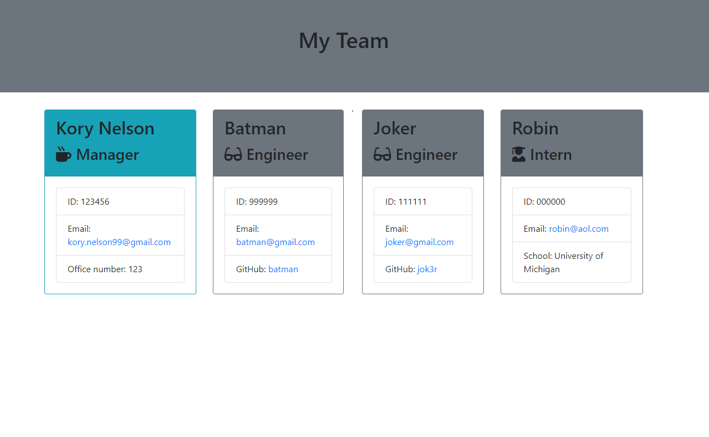

# Employee Summary Generator

## Description
This is a node.js CLI application that can build an HTML page of an team of employees.  The application includes 3 classes of employees.  1 Manager leads the team and enigneers and interns can be added as desired through node CLI.

## Table of Contents
* [Installation](#installation)
* [Usage](#usage)
* [Credits](#credits)
* [License](#license)
* [Contributing](#Contributing)
* [Tests](#Tests)
* [Questions](#Questions)

## Installation
Clone this repository and run command "npm install" to get dependencies

## Usage
Enter the command "node app.js" to start application and follow the promts in node cli

## License
This repository is licensed under the MIT license

## Contributing
No additional contributions are expected for this application

## Tests
There are 17 total tests in this application to validate the employee classes.  These test can be run using the command "npm run test"

## Questions
#### For any questions about this repository send an email to kory.nelson99@gmail.com
#### View my full GitHub at [https://github.com/korynelson](https://github.com/korynelson)

